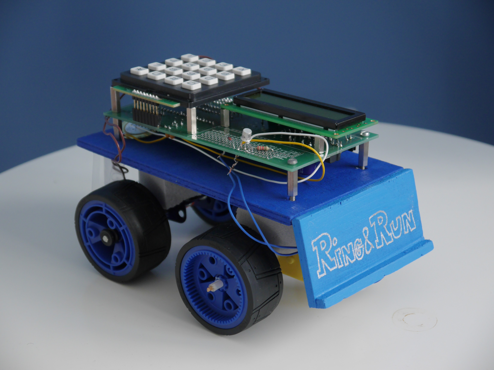
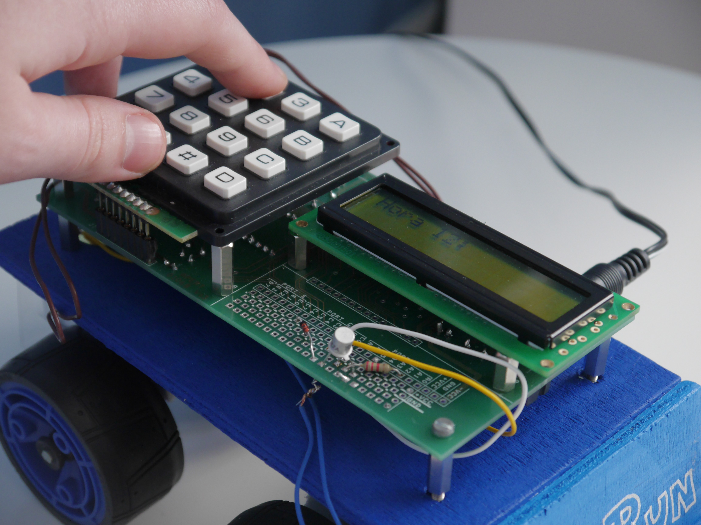
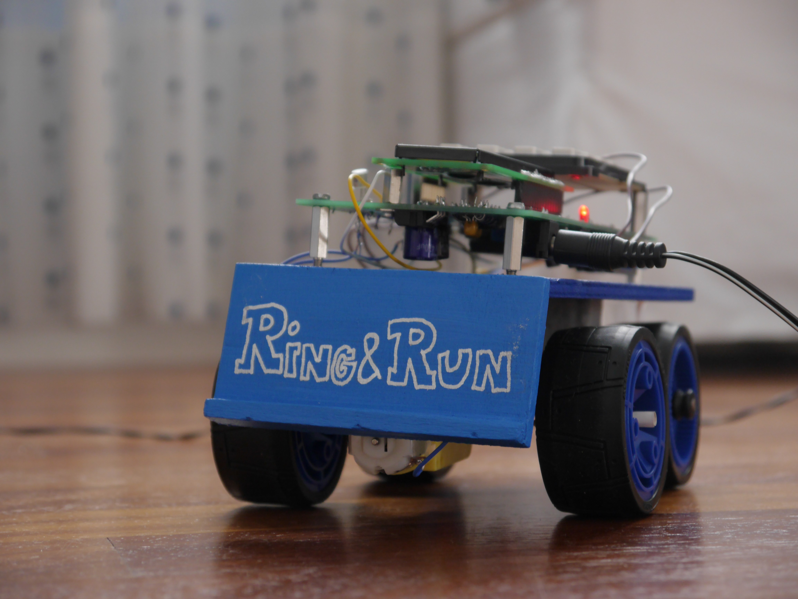

# Ring'N'Run
Are you a late bird? Do you oversleep whenever you hear the words ‘class’ or ‘work’? Would you like not to be late everytime due to hitting the Snooze button for the bazillionth time? Are you reading this with a teleshopping ad-like voice?
If your answer to every one of these questions is yes (or at least to 75% of them), you’ve just found the perfect item for you!
The new Ring&Run alarm clock will wake you completely up from the first time it rings (yes, the first time! Goodbye to the 2h delay!), thanks to:

* Its revolutionary motor system, which makes Ring&Run start running around as soon as the alarm goes off
* The annoying sound it makes (forget about all those nice songs and configurable radio channels!)

You can watch our ~~fake~~ completely legit commercial ad [here](https://youtu.be/a_9L4LQxCcY).

## Background
Ring&Run was developed by [Jimena Cabrejas](https://github.com/jimenaCabrejas) and [Lucía Conde](https://github.com/luciaconde) as a class project for the final assignment in the course *Sistemas Digitales* (Digital Systems), during the 3rd year of BSc Telecommunications Technology Engineering at the University of the Basque Country. It was designed for the PICTOR electronic system developed by APERT (Applied Electronics Research Team) and programmed in Assembly using MPLAB-IDE. Note that the abovementioned course was taught in Spanish hence most of the resources available within this repository are currently only in this language.

## System characteristics
Ring&Run is made up of the following components:
* 1x PICTOR (Microchip’s PIC16F887 microcontroller-based system)
* 1x AC-DC 16V @1.3A current adapter, replaceable with a 9V battery if a further reach is desired for Ring&Run’s movement
* 1x 5V DC motor
* 1x piezoelectric speaker
* 4x wheels
* 1x wooden structure (16.3 x 9.3 x 0.5 cm)
* 2x metallic axes coupled to the wooden structure through shock-absorbing styrofoam blocks

Ring&Run offers the following options:
* Configurable digital clock (24h)
* Alarm clock setup

## Media

